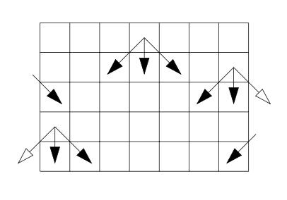

# Max-Sum

 Project 3 for the course "Introduction to Programming" in Semester 1.  
A project about finding the maximum sum in a grid with flipped sides starting from the first block of the grid (up and left - position (0,0)) to the last block (down and right - position (n,m)) 

The image below shows how you can move inside the grid.

 

Three methods are implemented for solving the problem:

* Recursive
* Recursive with memoization (top-down dp)
* Iterative with dynamic programming (bottom-up dp)

Here is an example of finding the maximum sum for the 2 grids below.

   

Using the recursive method:

``` bash

$ ./maxsumrec
6 5
7 4 5 2 7 
6 9 1 6 3 
9 2 7 9 8 
8 8 1 7 2 
2 3 1 8 4 
4 6 5 4 6
Running maxsumrec 
Max sum is 44
$
$ ./maxsumrec
6 5
7 4 5 2 7 
6 9 1 6 3 
9 2 7 9 8
8 8 1 7 9
2 3 1 8 8 
4 6 5 4 7
Running maxsumrec 
Max sum is 49
$

```

Using the recursive with memoization method (top-down dp):

``` bash

$ ./maxsummem
6 5
7 4 5 2 7 
6 9 1 6 3 
9 2 7 9 8 
8 8 1 7 2 
2 3 1 8 4 
4 6 5 4 6
Running maxsummem 
Max sum is 44
$
$ ./maxsummem 65
7 4 5 2 7 
6 9 1 6 3 
9 2 7 9 8 
8 8 1 7 9 
2 3 1 8 8
4 6 5 4 7 
Running maxsummem
Max sum is 49
$

```

Running the three methods for the test case ("input.txt") file provided:

``` bash

$ cat input.txt 
14 16
   7   38    8   98   85   47   31   38   49   24   86   96   15   77   32   78 
  96   54    0   66   55   46   31   54   22    8   54   73   61   34   22   69 
  72   30   67    9   29   98   99   30   75   85   26   42   14   58   20   10 
  65   72   77   20   70   60   26   92   21   80   18   82   66   40   51   90 
  22   71   51   52   21   50   82   96   87   61   38    1   19   11   64   36 
  83   93    8   54   53   34   46   74   67   16   57   33   56   60   24   31 
  31   75   83   53   78   17    1   65   78   40   19   50    3   83   38   86 
  76   47   92   81   33   91   56   52    7   65   86   16   77   62   47    9 
  89   82   14   67   99   15   85   30    7    4   32   10   39   70   49   15 
  69   41   96   55   32    4    7   40   21   93    8   99   55   55   60   97 
  89   74   64   40   41   49   70    1    5   54   63   44   25   12   11   46 
  54   60    1   86   64    9   78   86    2   38   85   10   93   45    7   34 
  71   23   75   64   25   97   65   30   52   29   75   77   93   38   23   47 
  98   77   86   63   86   16    1   40   55   38    2    0   35   61   35   58 
$ ./maxsumrec < input.txt 
Running maxsumrec
Max sum is 1146
$  
$ ./maxsummem < input.txt
Running maxsummem
Max sum is 1146
$
$ ./maxsumdp < input.txt 
Running maxsumdp
Max sum is 1146
$

```

It is included a program that generates random matrices (grids) for testing the project.  

randmatr_&lt;arch> , whereas &lt;arch> it is "linux", "windows.exe" or "maxosx".

* randmatr_&lt;arch>: Generates a random matrix with 10 rows and 10 columns, with values from 0 to 99 and seed for random number generator the current time.

* randmatr_&lt;arch> &lt;N>: Generates a random matrix with &lt;N> rows and 10 columns with values from 0 to 99 and seed for random number generator the current time.
 
* randmatr_&lt;arch> &lt;N> &lt;M>: Generates a random matrix with &lt;N> rows and &lt;M> columns with values from 0 to 99 and seed for random number generator the current time.
 
* randmatr_&lt;arch> &lt;N> &lt;M> &lt;Maxvalue>: Generates a random matrix with &lt;N> rows and &lt;M> columns with values from 0 to &lt;Maxvalue>-1 and seed for random number generator the current time.
 
* randmatr_&lt;arch> &lt;N> &lt;M> &lt;Maxvalue>: Generates a random matrix with &lt;N> rows and &lt;M> columns with values from 0 to &lt;Maxvalue>-1 and seed for random number generator the &lt;Seed>.

An example of using the randmatr_linux using the three methods:

```bash

$ ./randmatr_linux 12 16 200 134 | ./maxsumrec 
Running maxsumrec
Max sum is 1896
$
$ ./randmatr_linux 20 22 10 1 | ./maxsummem
Running maxsummem
Max sum is 163
$
$ ./randmatr_linux 10000 10000 100 999 | ./maxsumdp 
Running maxsumdp
Max sum is 815519
$

```

There is also another feature included in the last two methods (Recursive with memoization and Iterative with dynamic programming) which finds and prints the path where the maximum sum occurs in the grid. This feature can be used by compiling using "gcc -DPATH ...".

Here is an example using the two methods for finding the maximum sum in the grid and the path which was followed for finding the maximum sum:

``` bash

$ gcc -DPATH -o maxsummempath maxsum.c maxsummem.c
$ gcc -DPATH -o maxsumdppath maxsum.c maxsumdp.c 
$
$ ./maxsummempath
6 5
7 4 5 2 7 
6 9 1 6 3 
9 2 7 9 8 
8 8 1 7 2 
2 3 1 8 4 
4 6 5 4 6
Running maxsummem 
Max sum is 44
7 -> 9 -> 7 -> 7 -> 8 -> 6
$
$ ./maxsumdppath < input.txt
Running maxsumdp
Max sum is 1146
78 -> 96 -> 72 -> 72 -> 71 -> 93 -> 83 -> 92 -> 82 -> 96 
$
```

It is included the statement of the project in Greek, which describes the project more analytically.
