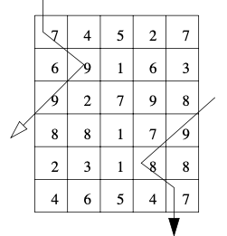

# Max-Sum

 Project 3 for the course "Introduction to Programming" in Semester 1.  
A project about finding the maximum sum in a grid with flipped sides.

Here is an example of how you can move in the grid.

 

Three methods are implemented for solving the problem:

* Recursive
* Recursive with memoization (top-down dp)
* Iterative with dynamic programming (bottom-up dp)
